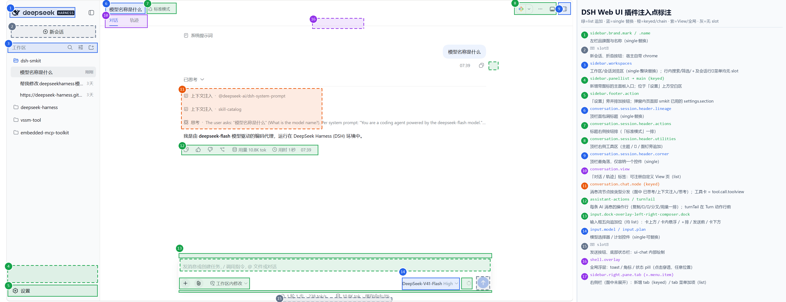

<!-- more -->

本文基于宿主 `@deepseek-ai/dsh 0.1.5-rc.1`（安装于 `D:\devSoftware\node-v24.19.0-win-x64\node_global\node_modules\@deepseek-ai\dsh`）的实测分析，回答一个问题：DSH Web 界面上，哪些位置允许插件放入自己的按钮或 UI。

## 一、 结论与机制

### 1. 一句话结论

DSH Web 界面整体就是一个 slot（插槽）组装出来的外壳，宿主共暴露约 40 个具名注入点。插件放按钮不走 hack，而是宿主的一等公民能力：在 `package.json` 的 `dsh.client.inject` 里声明需要的 UI 包，再在客户端 `apply()` 里注册对应 slot 即可。本项目 dsh-smkit 往「设置 → MCP」塞页面用的正是这套机制。

### 2. 注入链路

（1）插件在 `package.json` 中声明 `dsh.client.platform: "web"` 与 `dsh.client.inject` 列表，列表里的宿主 UI 包会被加载并作为服务注入插件客户端半区；

（2）客户端半区入口导出 `inject`（所需服务名）与 `apply(ctx)`，见 [`src/client/entry.ts`](../src/client/entry.ts)；

（3）在 `apply()` 里调用 `ctx.slots.inject(槽名, 工厂)` 声明占位，工厂里用 `ctx.slots.register(选项, 组件)` 完成注册，见 [`src/client/runtime/plugin.ts`](../src/client/runtime/plugin.ts)。

slot 契约的权威定义在各宿主 UI 包的 `lib/types/client/contract/slots.d.ts` 中（如 `@deepseek-ai/dsh-client-ui-conversation`、`@deepseek-ai/dsh-client-ui-sidebar`），每个 slot 的名字、形态与组件 props 都以该文件为准。

### 3. slot 的四种形态

- `list`：列表型，按注册时的 `order` 追加渲染，宿主自带条目与插件条目并存，是官方预留的「放按钮」座位，最理想；
- `keyed`：按键分发型，key 域通常是工具名、节点类型、tab 类型等开放集合——注册新 key 是新增，注册已有 key 是接管；
- `single`：单人座位，默认由宿主组件占据，插件去占即整体替换宿主自带 UI，代价最大；
- `chain`：链式接管，按选择器顺序第一个不拒绝的生效，适合「某条件下整个换掉某块 UI」的场景。

## 二、 注入点全景图

下图在真实界面截图上标注了全部主要注入点，编号与下文各表对应：



图中颜色与 slot 形态对应：绿 = `list` 追加、蓝 = `single` 替换、橙 = `keyed`/`chain`、紫 = View/全局、灰 = 无 slot。

## 三、 按界面区域的注入点明细

### 1. 左侧栏

| 位置 | slot | 形态 |
| ---- | ---- | ---- |
| 品牌图 / 品牌名 | `sidebar.brand.mark` / `sidebar.brand.name` | single |
| 新增整个主面板入口（带图标，点击切换中央区域） | `sidebar.panellist` ＋ `main`（keyed） | list ＋ keyed |
| 工作区 / 会话浏览区 | `sidebar.workspaces` | single |
| 「设置」行旁并排按钮 | `sidebar.footer.action` | list |
| 「设置」上方空白区 | `sidebar.panellist` 条目展开后的图标列表 | list |

`sidebar.workspaces` 是整块替换，一般不动；工作区行右侧的搜索 / 筛选 / ＋ 图标属于 ui-workspace 内部实现，没有独立 slot。

### 2. 顶栏（会话头部）

| 位置 | slot | 形态 |
| ---- | ---- | ---- |
| 面包屑标题 | `conversation.session.header.lineage` | single |
| 标题右侧按钮排（「1 个子代理 / 标准模式」一排） | `conversation.session.header.actions` | list |
| 顶栏右侧工具区（主题 / ⋯ / 图钉旁追加） | `conversation.session.header.utilities` | list |
| 顶栏最角落 | `conversation.session.header.corner` | single |

`corner` 全头部只容纳一个控件，先到先得。

### 3. 对话区（View 标签与消息流）

| 位置 | slot | 形态 |
| ---- | ---- | ---- |
| 「对话 / 轨迹」标签页 | `conversation.view` | list |
| 工具调用卡片 | `tool.call.toolview`（按工具名分发）；cordis 插件交互卡为 `tool.view.cordis`（key `'self'`） | keyed |
| 每条 AI 消息的操作行 | `conversation.chat.assistant-actions` | list |
| 每个完成 Turn 的动作行前 | `conversation.chat.turnTail` | chain |
| 消息流各类节点 / 命令卡片 | `conversation.chat.node` / `conversation.chat.commandview`（按类型分发） | keyed |
| 审批卡详情 | `conversation.approval.detail` | single |

### 4. 输入框（composer）

| 位置 | slot | 形态 |
| ---- | ---- | ---- |
| 输入框卡片上方整行 | `conversation.input.dock` | list |
| 输入框卡片内悬浮 | `conversation.input.overlay` | list |
| 工具行左侧（＋ / 麦克风那一排） | `conversation.input.left` | list |
| 工具行右侧（发送键之前） | `conversation.input.right` | list |
| 输入框卡片下方一行 | `conversation.composer.dock` | list |
| 模型选择器 / 计划控件 | `conversation.input.model` / `conversation.input.plan` | single |
| 附件栏 | `conversation.input.attachments` | single |
| 整个输入框 | `conversation.composer`（chain）/ `conversation.composer.bar`（single） | 接管 |

空白新会话页另有三个 single 座位：`conversation.hero.brand.mark`、`conversation.hero.workspace`、`conversation.hero.agentPreset`。

### 5. 右侧栏

| 位置 | slot | 形态 |
| ---- | ---- | ---- |
| 新增一个 tab 类型 | `sidebar.right.pane.tab` ＋ `sidebar.right.pane.tab.title` | keyed |
| tab 的「⋯」菜单末尾追加项 | `sidebar.right.tab.menu.item` | list |
| 引导页整体替换 | `sidebar.right.tab.guide` | chain |
| 整栏内容 | `rightbar` / `rightbar.session` | single |

### 6. 设置弹窗

| 位置 | slot | 形态 |
| ---- | ---- | ---- |
| 新增一个设置页（dsh-smkit 已用） | `settings.section` | list |
| General 页追加一行偏好 | `settings.general.item` | list |
| 内容列头部 Close 前的按钮 | `settings.action` | list |
| 插件页新增 tab / 插件卡片扩展区 | `settings.plugins.tab` / `settings.plugin.item` | list / keyed |
| 模型页 provider 卡扩展区 / 页脚 | `settings.models.provider-card` / `settings.models.footer` | keyed / list |
| 首次启动引导步骤 | `settings.onboarding` | list |

### 7. 全局浮层

`shell.overlay` 是 frame 级浮层（list）：toast、角标、状态 pill 都属于这里，条目之间自行排序；浮层本身点击穿透，不挡底层界面。任何没有专属 slot 的悬浮展示需求都可以落到这个座位。

## 四、 没有 slot 的区域

以下区域由宿主内部绘制，v0.1.5-rc.1 未开放注入点：

- 底部状态栏（「1 轮 30 步 · 30 tok/s / 缓存命中 37%」），由 `@deepseek-ai/dsh-client-ui-chat` 内部渲染；
- 新会话按钮、侧栏折叠按钮、发送按钮等宿主 chrome；
- 工作区行右侧的搜索 / 筛选 / ＋ 图标。

需要在这类位置呈现信息时，替代方案是用 `shell.overlay` 自绘浮层定位模拟；但会随窗口布局漂移，仅建议用于非关键入口。

## 五、 接入方法

### 1. 声明依赖

在插件 `package.json` 的 `dsh.client` 里追加需要的 UI 包，包决定能注入哪些区域的 slot：

```jsonc
// package.json
"dsh": {
  "client": {
    "platform": "web",
    "inject": [
      "@deepseek-ai/dsh-client-runtime",
      "@deepseek-ai/dsh-client-ui-settings",
      "@deepseek-ai/dsh-client-locale",
      "@deepseek-ai/dsh-client-ui-conversation",
      "@deepseek-ai/dsh-client-ui-sidebar"
    ]
  }
}
```

### 2. 注册 slot

以往输入框工具行左侧加一个按钮为例：

```ts
// src/client/runtime/plugin.ts（节选）
ctx.slots.inject('conversation.input.left', () =>
  ctx.slots.register(
    { name: 'conversation.input.left', id: 'my-button', order: 90 },
    MyButton,
  ),
)
```

`register` 选项里 `id` 是条目身份（卸载与去重用），`order` 决定在同 list 中的位置；组件会收到宿主注入的标准 props（Session 状态、`InputState` 等），声明 `locale` 后还会拿到 `t` 翻译函数，写法与本项目 `settings.section` 的注册一致。

### 3. 参考实现

- 本项目：[`src/client/runtime/plugin.ts`](../src/client/runtime/plugin.ts) 注册 `settings.section` 的完整流程；
- 第三方实证：已装入 web profile 的 `dsh-better-sidebar` 插件同时注入了 `conversation.session.header.utilities`（顶栏按钮）、`conversation.chat.turnTail`（Turn 尾部按钮）、`settings.section` 与右侧栏 tab，说明这些座位对第三方插件完全开放。

---
*本文档由 markdowncli 技能辅助生成*
