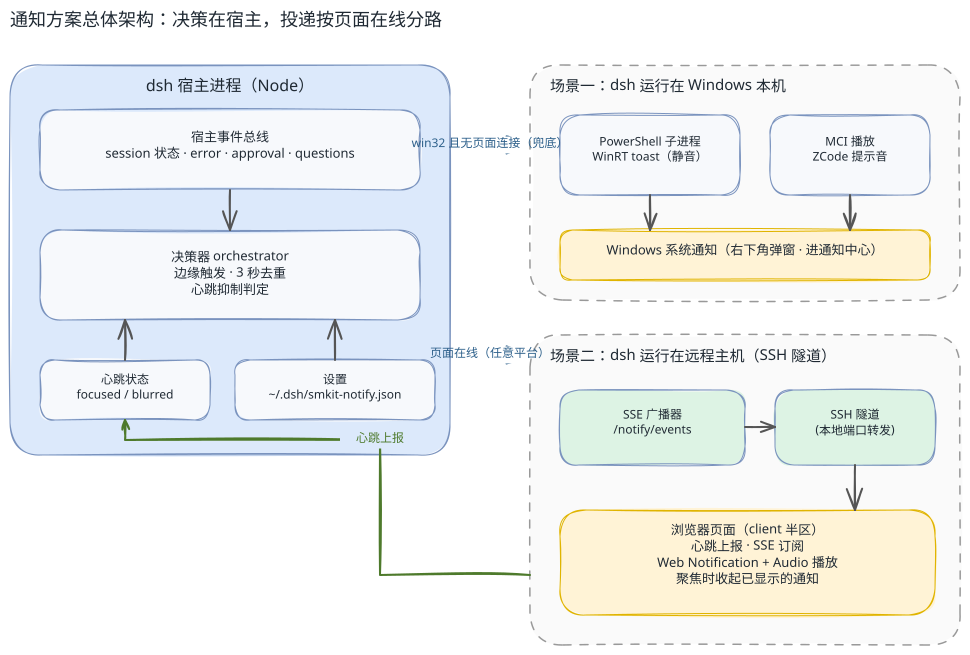
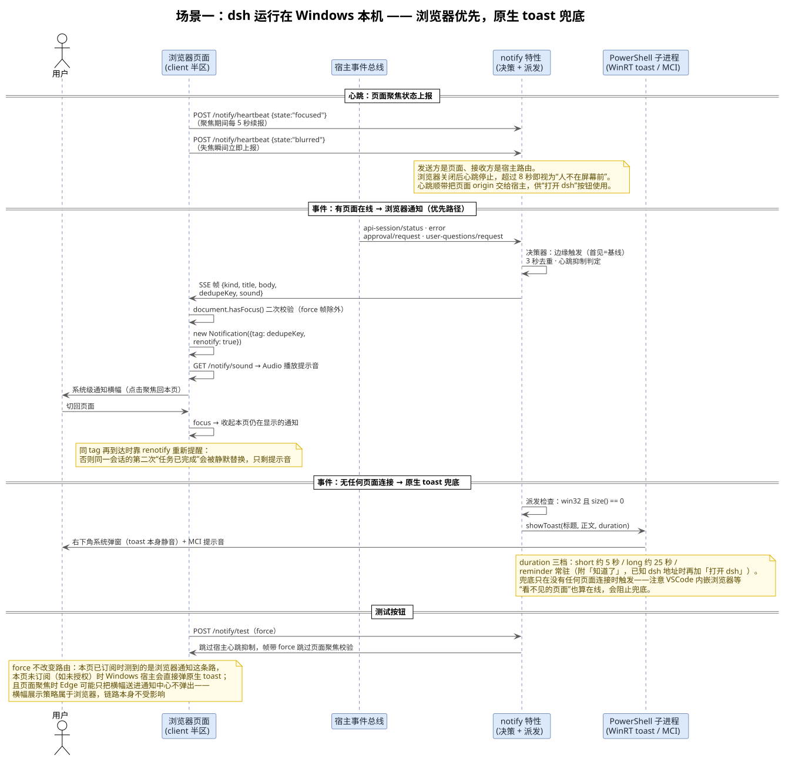
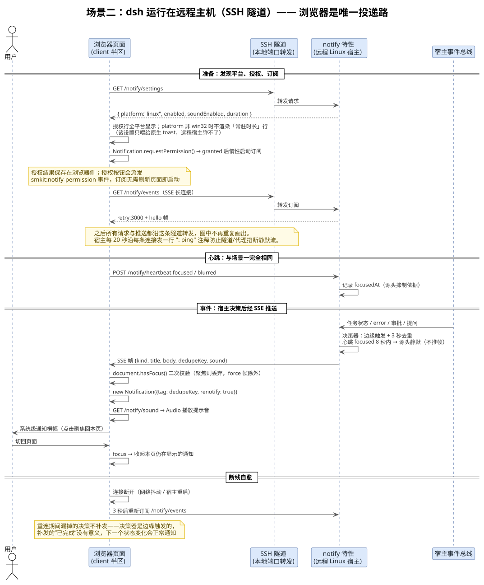

<!-- more -->

## 一、 背景与目标

### 1. 问题与动机

dsh 启动后在浏览器里打开 Web 界面，AI 任务的状态变化（完成、出错、等待审批、等待提问回复）只体现在页面内容上。用户切到别的窗口、甚至关掉浏览器之后，任务结束了也没有任何提醒，必须主动切回来查看才能发现。

同类的桌面编码工具（如 ZCode）已经验证了更好的体验：任务完成或需要用户操作时，弹一条系统通知并播放提示音。本方案把这套体验带进 dsh，以 dsh-smkit 插件的形式实现，通知行为与 ZCode 保持一致。

### 2. 设计目标

- 浏览器关闭、页面失焦时依然能收到通知，不依赖页面存活；
- 通知带提示音，音源直接复用 ZCode 的提示音文件；
- 触发与静默逻辑对齐 ZCode：只在状态变化的"边缘"发通知，用户正盯着屏幕时保持安静；
- 同时覆盖两种宿主形态——dsh 跑在 Windows 本机、dsh 跑在远程 Linux 主机通过 SSH 隧道访问；
- 通知弹出后不会赖着不走：用户回到页面即视为已阅，通知自动收起。

## 二、 总体架构

### 1. 架构总览

方案的核心思路是"决策在宿主，投递按页面在线分路"：所有任务事件都汇入 dsh 宿主进程的事件总线，由通知决策器统一判断"要不要通知、通知什么"；而"怎么把通知送到人眼前"由派发器按**当前有没有页面连着**决定——有任何页面在线（任意平台，包括 Windows），通知就经 SSE 推给浏览器弹 Web 通知；一个页面都没有（浏览器全关了），Windows 宿主才亲自弹原生系统通知兜底。



图中实线框为 dsh 宿主进程内部的模块，两个虚线框分别是两条投递链路的归属场景：右上是被兜底路径覆盖的"无页面"情形，右下是优先路径依赖的"页面在线"情形，绿色箭头是唯一一条从浏览器流回宿主的上行数据（心跳）。架构源文件为 [arch-overview.excalidraw](./LV030-通知方案设计/arch-overview.excalidraw)，可在 Excalidraw 中直接编辑。

### 2. 模块划分

宿主半区（Node 进程内）：

- [`src/host/features/notify/orchestrator.ts`](../src/host/features/notify/orchestrator.ts)：决策器，纯函数式的"要不要通知"判定（边缘触发、去重、心跳抑制判定），不含任何 I/O；
- [`src/host/features/notify/title.ts`](../src/host/features/notify/title.ts)：决策瞬间读会话标题（先宿主标题服务、后投影缓存），供完成/出错通知点名任务，读不到只损失这一行文案；
- [`src/host/features/notify/toast.ts`](../src/host/features/notify/toast.ts)：构造 PowerShell 脚本并弹出 WinRT 系统通知（原生兜底路径）；
- [`src/host/features/notify/sound.ts`](../src/host/features/notify/sound.ts)：从内嵌 base64 还原提示音字节，供 MCI 播放与 HTTP 路由共用；
- [`src/host/features/notify/settings.ts`](../src/host/features/notify/settings.ts)：设置的读写与逐字段归一化，落盘 `~/.dsh/smkit-notify.json`；
- [`src/host/features/notify/broadcaster.ts`](../src/host/features/notify/broadcaster.ts)：SSE 广播器，维护页面订阅连接并把通知帧推给所有订阅者（浏览器投递路径）；
- [`src/host/features/notify/api.ts`](../src/host/features/notify/api.ts)：注册 `/smkit/api/notify/*` 全部 HTTP 路由，含心跳的接收端；
- [`src/host/features/notify/host.ts`](../src/host/features/notify/host.ts)：装配入口，挂事件总线监听、按页面在线与否分路派发。

客户端半区（注入 dsh 页面的 JS）：

- [`src/client/features/notify/client.ts`](../src/client/features/notify/client.ts)：三个职责——心跳上报（发送方）、SSE 订阅与 Web 通知投递、页面聚焦时收起本页仍显示的通知；
- [`src/client/features/notify/components/NotifyPanel.tsx`](../src/client/features/notify/components/NotifyPanel.tsx)：设置页"通知"面板。

两端共享的契约在 [`src/shared/notify/contract.ts`](../src/shared/notify/contract.ts)，定义常驻时长类型 `NotifyDuration`（`short` / `long` / `reminder`）与其默认值。

## 三、 通知决策逻辑

决策器完整复刻 ZCode 的通知判定，见 [`src/host/features/notify/orchestrator.ts`](../src/host/features/notify/orchestrator.ts)。

### 1. 边缘触发

决策器只认"状态变化的边沿"，不认电平。每个 session 首次被观察到时记为基线，不发通知；之后 `running` 从 true 变 false 才算"完成"。这样避免了插件启动、页面刷新时把所有正在进行的任务都当作"刚完成"弹一轮。完成前 30 秒内出过错的 session 不再补发"已完成"，避免"出错"和"已完成"连弹两条。子 agent 会话的完成与出错不打扰（它们是父任务的内部机器），但子代理要确认时仍会提醒。

### 2. 去重与多任务

每个候选通知带一个去重键，3 秒窗口内相同键只发第一条（`NOTIFY_DEDUPE_WINDOW_MS`）。多个任务同时结束时各自独立判断、各弹各的通知——与 ZCode 一致，不做聚合成"3 个任务已完成"。

### 3. 通知文案

| 事件 | 标题 | 正文 |
| ---- | ---- | ---- |
| 任务完成 | 任务已完成 | `任务：<标题>`；无标题时回退 `工作区：<目录名>` |
| 任务出错 | 任务出错 | 错误摘要；事件未带信息时走上面的标题/工作区回退 |
| 等待审批 | 需要你的确认 | 审批理由，否则 `工具：<工具名>`，连工具名都没有则是 `工具调用等待确认` |
| 等待提问回复 | 需要你的回复 | 首个问题，否则 `有问题等待你的回答` |
| 计划待确认 | 计划等待确认 | 请确认计划后继续执行 |

完成与出错正文里的标题在**决策瞬间**读取（[`src/host/features/notify/title.ts`](../src/host/features/notify/title.ts)）：先问宿主的标题服务（会话在途时最新鲜），再读 dsh 的会话投影缓存文档（面板会话列表标题的同一来源）；两级都取不到（会话还没发过消息、缓存被清、服务未挂载）只损失这一行文案，通知照发。标题按次读取不缓存，同一会话改名后，下一次完成通知就会用新标题。

去重键按事件类型构造：完成与出错是 `completed:<sessionId>` / `failed:<sessionId>`；审批是 `permission_request:<agentId>:<toolName>`；提问是 `elicitation_request:<agentId>:<问题 id>`，其中计划确认类问题不认问题 id，固定以 `plan-review` 作目标。这些键随帧下发成为 Web 通知的 `tag`，见第五章。

## 四、 心跳机制

### 1. 为什么需要心跳

ZCode 的唯一静默条件是"窗口正被聚焦"：窗口在前台时什么都不发，没有别的离开检测。移植到 dsh 的 Web 架构后这条规则遇到一个根本问题——**宿主进程看不见浏览器窗口**。任务事件发生在 Node 进程里，而"用户是否正看着屏幕"这个事实只存在于浏览器里，两者没有共享状态。

心跳就是补上这一块的桥：由页面把自己 `document.hasFocus()` 的状态周期性报告给宿主，宿主据此在**源头**决定要不要发通知。它同时天然解决了反向需求——浏览器一关心跳就停，宿主在新鲜窗口过期后自动恢复提醒，"浏览器关闭也能弹窗"不需要任何额外机制。此外心跳还顺带承载一个次要信息：页面报告自己被服务的 `origin`，宿主记住它作为原生 toast 的点击跳转地址——toast 本体的 protocol 点击与 reminder 档的「打开 dsh」按钮都指向它。

### 2. 发送方与接收方

- **发送方**：[`src/client/features/notify/client.ts`](../src/client/features/notify/client.ts) 的 `notify/heartbeat` effect。挂载时立即上报一次当前状态（后台标签页直开时不发假心跳）；之后 `focus` / `blur` 事件各自立即上报；聚焦期间由 5 秒定时器续报（定时器回调里先确认 `document.hasFocus()` 仍为真才发）。上报是普通 `POST /notify/heartbeat`，请求体 `{"state":"focused"}` 或 `{"state":"blurred"}`，失败静默吞掉（老宿主 404、瞬时断网都不影响页面）。
- **接收方**：[`src/host/features/notify/api.ts`](../src/host/features/notify/api.ts) 的心跳路由。它调用决策器的 `touchHeartbeat(state)` 记录 `focusState` 与 `focusAt` 时间戳，同时把请求事实里的 `origin` 交给装配层存为 `launchOrigin`。决策器不认识 HTTP，宿主路由是它唯一的感官。

### 3. 抑制判定与 8 秒新鲜窗口

派发一条通知前（测试帧除外），宿主检查 `isSuppressed()`：`focusState === 'focused'` 且距最后一次心跳不足 8 秒（`FOCUSED_HEARTBEAT_FRESH_MS`）。新鲜窗口取 8 秒而不是 5 秒，是为了容忍一次丢包的续报仍不误报"人走了"。页面端还有第二道防线：投递 effect 收到帧后再查一次 `document.hasFocus()`，堵住"宿主决策瞬间用户恰好切回来"的竞态。两道防线各自独立，测试帧（`force`）可以同时越过它们。

### 4. 开销量级

- 聚焦期间每页每分钟 12 个 POST，请求体 19 字节，加上头部约百字节级——本机 localhost 或 SSH 隧道上每分钟不到 2 KB，且连接复用，可忽略；
- 失焦期间**零周期流量**：定时器回调里的 `hasFocus()` 为假直接不发，只剩失焦与恢复聚焦时各一个瞬时请求；
- 页面关闭后零流量，宿主侧 8 秒后自动恢复提醒；
- 心跳是上行 POST，与下行 SSE 订阅互相独立：未授权浏览器通知的页面没有 SSE 连接，但心跳照常工作（此时 Windows 宿主的原生兜底也照常按抑制规则静默）。

## 五、 投递路由与两种宿主场景

### 1. 浏览器优先、原生兜底

派发器（[`src/host/features/notify/host.ts`](../src/host/features/notify/host.ts) 的 `dispatch()`）按一个条件分路：`process.platform === 'win32' && broadcaster.size() === 0`。即：

- **有任何页面在线**（任意平台，包括 Windows）：走 SSE 广播，由页面弹 Web 通知。优先选它的原因是体验——Web 通知点击**聚焦回已有标签页**，而原生 toast 的 protocol 跳转只会新开一个标签页；
- **一个页面都没有**且宿主是 Windows：走 PowerShell 原生 toast 兜底。这是浏览器覆盖不了的唯一情形（浏览器关了），此时"点击新开标签页"反而是唯一合理的点击行为。

两条路按构造互斥，不存在双弹。注意分路判据是**页面连接数**而不是"用户看得见"：VSCode 内嵌浏览器里忘关的标签页、其他设备上开着的页面，都算在线，都会阻止兜底路径——这是实测踩过的坑，见第七章。

### 2. 浏览器投递路径（两种场景共用）

页面经 `GET /notify/events` 与宿主保持一条 SSE 长连接。连接建立即收到 `retry: 3000` 重连提示与 hello 帧；宿主每 20 秒沿每条连接写一行 `: ping` 注释，防止隧道与代理掐断静默流。决策通过后，宿主把决策广播成一帧：

```jsonc
// src/host/features/notify/broadcaster.ts（帧结构）
{ "type": "notify", "kind": "completed", "title": "任务已完成",
  "body": "任务：修复登录超时", "dedupeKey": "completed:s1", "sound": true,
  "force": true }
```

`force` 只在测试帧上出现。页面侧投递（`deliver()`）依次做四件事：

（1）**聚焦校验**：非 force 帧在 `document.hasFocus()` 为真时直接丢弃——与宿主的心跳抑制互为冗余，堵住切回页面的竞态；

（2）**弹通知**：`new Notification(title, { body, tag: dedupeKey, renotify: true })`。`tag` 用去重键，多个标签页同收一帧也只显示一条；`renotify` 让同 tag 的替换重新提醒——没有它，同一会话的第二次"任务已完成"会静默替换上一条，只剩提示音；

（3）**放声音**：`sound` 为真时从 `/notify/sound` 拉取提示音（首次转 blob URL 缓存，重放前把 `currentTime` 归零），用 `Audio` 播放；

（4）**收起管理**：弹出的通知进入本页的存活集合。三个收起途径——用户点击通知（顺便聚焦页面）、用户切回页面（`focus` 事件统一清扫存活集合）、effect 销毁时兜底清扫。"回到页面即已阅"是产品语义：通知不该为已经返回的任务留在通知中心。

### 3. 场景一：dsh 运行在 Windows 本机

宿主与浏览器同机。页面在线时走浏览器投递；浏览器全关时走原生兜底——`showToast()` 通过 PowerShell 子进程调用 WinRT 的 `ToastNotificationManager` 弹系统通知，提示音由同一个 PowerShell 子进程经 MCI 播放。



原生兜底的实现细节（[`src/host/features/notify/toast.ts`](../src/host/features/notify/toast.ts)）：

- **中文安全**：PowerShell 5.1 按 ANSI 读无 BOM 的 UTF-8 脚本，中文文案直接写 `.ps1` 会报"字符串缺少终止符"。脚本内容先按 UTF-16LE 编码再 base64，经 `-EncodedCommand` 传入，任何代码页下都不会坏；
- **AUMID**：借用 PowerShell 自带的 AUMID，无需安装 Appx 包即可让通知显示来源并进通知中心，代价是通知来源显示为"Windows PowerShell"；
- **常驻时长**：toast 根节点属性按档位切换——`short` 默认约 5 秒；`long` 约 25 秒；`reminder` 常驻直到手动关闭（此模式要求至少一个按钮，因此总是附"知道了"，已知 dsh 地址时再加"打开 dsh"）；
- **提示音**：mp3 以 base64 内嵌（[`src/host/features/notify/sound-data.ts`](../src/host/features/notify/sound-data.ts)，由 `scripts/generate-sound-data.mjs` 生成），宿主解码到临时目录后用 `winmm.dll` 的 MCI 播放（`type mpegvideo` 直接播 mp3，无需解码器）。toast 本身 `silent="true"`，声音只响一次不重复。

### 4. 场景二：dsh 运行在远程主机（SSH 隧道）

dsh 进程跑在远程 Linux 主机上，Windows 浏览器经 SSH 本地端口转发访问。宿主没有桌面可弹，**浏览器是唯一投递路**，实现与场景一的浏览器路径完全相同。



场景特有的两件事：

- **授权**：设置接口响应带 `platform` 字段，但授权行全平台显示（Windows 用户同样可以选浏览器代发）。授权结果存浏览器侧，`granted` 后订阅才惰性启动——授权按钮会派发 `smkit:notify-permission` 窗口事件，订阅无需刷新页面即启动；`denied` 只能去浏览器站点设置恢复。Web Notification 要求安全上下文：经 `localhost` 走隧道恰好满足；改用局域网 IP 直连则 API 不存在，页面静默降级。
- **常驻时长行**：该设置只喂给原生 toast，远程宿主弹不了，面板在 `platform` 非 `win32` 时不渲染这一行（Windows 宿主上页面在线、由浏览器代发时它同样不生效，面板在该行补说明）。

## 六、 配置与接口

### 1. 设置存储

设置持久化在 `~/.dsh/smkit-notify.json`（见 [`src/host/features/notify/settings.ts`](../src/host/features/notify/settings.ts)），三个字段：`enabled`（总开关，默认开）、`soundEnabled`（提示音，默认开）、`duration`（常驻时长档位，默认 `short`）。反序列化时逐字段归一化：合法值保留、`null` 回落默认值、非法垃圾值保持原样不覆盖用户文件。

### 2. 设置界面

设置页"通知"标签（`NotifyPanel`）：

- 桌面通知、提示音两个开关，拨动即保存，以宿主应答为准；
- 常驻时长三档下拉，仅在 Windows 宿主渲染；已授权浏览器通知时该行追加说明"时长由浏览器决定，关闭页面后才按此停留"；
- 浏览器通知授权行，全平台显示：未授权出"授权通知"按钮，已授权/已拒绝/不支持各出徽章与对应提示；「已被拒绝」时行内再给出该浏览器的通知设置页地址与「复制地址」按钮（见六.3）；
- 底部"发送测试通知"按钮。

### 3. 授权行何时显示「已被拒绝」

授权行徽章读的是浏览器 `Notification.permission` 的实时值，`denied`（已被拒绝）在以下情况出现：

（1）授权弹窗里点过"阻止"：点「授权通知」按钮后浏览器弹出权限询问，选择了阻止——浏览器按站点（scheme + 域名 + 端口）记住这个答案，之后访问该站点一直读作 `denied`；

（2）历史遗留的站点级拒绝：更早的会话里对该站点选过阻止，本次打开页面时不经询问直接就是 `denied`——浏览器对明确拒绝过的站点不会再弹询问；

（3）浏览器站点设置里被手动改为"阻止"：地址栏锁图标 → 网站权限 → 通知 → 阻止，或浏览器的通知内容设置里把该站点设为阻止；

（4）浏览器全局关闭网站通知（"不允许网站发送通知"）或企业策略封禁——此时所有站点都读作 `denied`，与 dsh 无关；

（5）浏览器的自动拦截：Chrome / Edge 会按历史交互自动拒绝判定为骚扰站点的通知请求，结果同样落成 `denied`。

注意区分：Windows 系统设置里关掉 Edge 的通知横幅**不是** `denied`——API 层仍是 `granted`，面板仍显示"已授权"，只是横幅展示被系统层吞掉（见第七章）。`denied` 只描述浏览器 API 层的授权状态。

`denied` 的实际后果与恢复：

- 页面侧订阅永不启动（`maybeStart()` 要求 `granted`），本页没有投递连接；Windows 宿主于是全程走原生 toast 兜底，非 Windows 宿主则完全收不到通知；
- 面板上此时不再有「授权通知」按钮（按钮只在 `default` 状态渲染）——浏览器拒绝为已明确拒绝的站点再次弹询问，代码里再调 `requestPermission()` 只会立即返回 `denied`；
- 唯一恢复途径是浏览器站点设置里改回"允许"——面板在 `denied` 状态下把该浏览器的通知设置页地址直接摆在行内：网页无法跳转 `edge://` 这类特权地址，地址由宿主按本次请求的 User-Agent 判定（认不出的浏览器不显示），做成整块可选中、配「复制地址」按钮交给你粘贴。改回后无需刷新页面：设置即时生效，页面的 `focus` 事件监听会重检权限，发现 `granted` 即自动启动订阅。

### 4. 测试按钮的语义

测试按钮 `POST /notify/test`，派发测试决策时带 `force`：宿主跳过总开关与心跳抑制，页面跳过聚焦校验。但 `force` 不改变路由——派发仍按"有没有页面订阅"分路，所以按钮测的是**当前状态下实际会走的那条路**：

- 本页已授权（持着 SSE 订阅）：测试帧走浏览器路径，页面弹 Web 通知；
- 本页未授权、也没有其他页面订阅：Windows 宿主直接弹原生 toast——这正好是一条不开页面就能验证兜底路径的捷径；非 Windows 宿主在同样情形下把帧广播给零个客户端，什么都看不到。

另一个浏览器侧的现实要写清：页面聚焦时，Edge 可能只把横幅送进通知中心而不弹出（浏览器对"正在查看的网站"的通知策略）——链路本身是通的，横幅的展示权在浏览器。

### 5. HTTP 接口一览

| 路由（前缀 `/smkit/api/notify`） | 方法 | 用途 |
| ---- | ---- | ---- |
| `/settings` | GET / POST | 读取 / 更新设置；响应带 `platform` 与 `webSettingsUrl`（按请求 User-Agent 给出该浏览器通知设置页的地址，认不出为 `null`） |
| `/heartbeat` | POST | 页面心跳（focused / blurred），接收方 |
| `/test` | POST | 强制派发测试通知，跳过抑制 |
| `/events` | GET | SSE 订阅，长连接，20 秒注释保活 |
| `/sound` | GET | 提示音字节（`audio/mpeg`），供页面播放 |

## 七、 边界情况与已知限制

- **"看不见的页面"阻止原生兜底**：分路判据是 SSE 连接数，VSCode 内嵌浏览器、其他设备上开着的标签页都算在线。想用真实任务事件验证兜底路径时，必须关掉所有 dsh 页面（含最容易忘的 VSCode 内嵌标签页）；只验证链路本身的话不必如此——见六.4，未授权页面上点测试按钮就会直接走原生 toast。
- **多标签页**：每个标签页独立订阅 SSE 并上报心跳。任一页面聚焦即全局静默；全部失焦时各页同收一帧，Web 通知因 `tag` 相同只显示一条，但页面内提示音可能叠加播放一次。
- **聚焦标签页的横幅策略**：Edge 等浏览器对"正在查看的网站"的通知可能不弹横幅、只进通知中心。这是浏览器行为，代码无法绕过；测试按钮在聚焦状态下点了"没弹"多半是它，链路可用 `Win+N` 在通知中心确认。
- **非安全上下文**：`Notification` API 只在 `localhost`、HTTPS 下存在。用局域网 IP 直连远程宿主时，页面没有通知 API 也不建 SSE 连接——非 Windows 宿主此情形下完全收不到，Windows 宿主则自然落到原生兜底。
- **授权被拒**：`denied` 的完整来源与恢复途径见六.3；要点是页面无法再发起授权请求，只能由用户在浏览器站点设置中恢复。
- **系统级拦截**：Windows 专注助手 / 勿扰模式可能拦截通知（原生 toast 与浏览器横幅都会被拦）；toast 来源显示"Windows PowerShell"是 AUMID 借用的代价。
- **投递互斥**：同一宿主同一时刻只走一条投递路（页面在线走浏览器，否则 win32 走原生），不会双弹；但"页面在线"包含后台标签页，横幅可能迟至用户看来"毫无动静"的时刻才被浏览器展示——后台标签的通知展示由浏览器与系统决定。

---

*本文档由 markdowncli 技能辅助生成*
